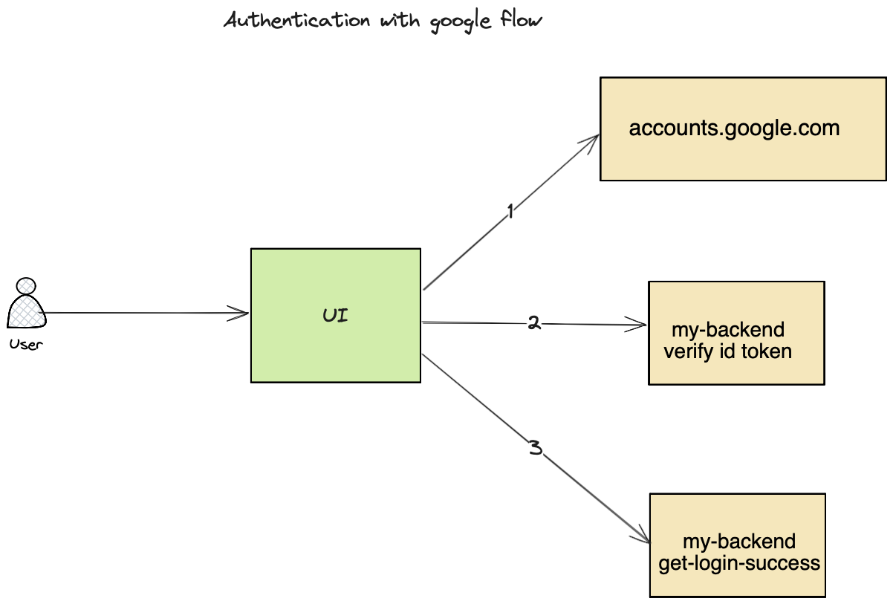
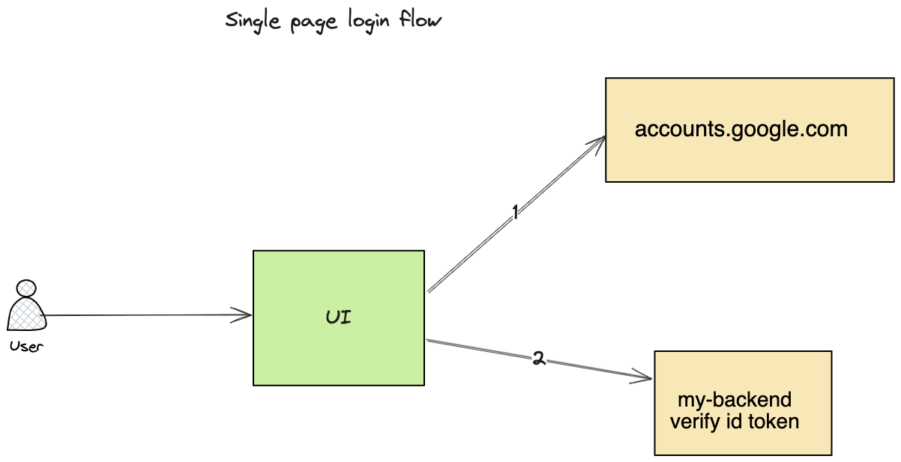

## Authentication with Google.  
Login with Google is used for password less authentication. 
It does not manage sessions and authorization. 
For session and authorizations, we have different flow like oauth2. This is specifically for password less auth only. 

### Useful links: 
1. [Google doc with fundamentals](https://developers.google.com/identity/gsi/web/guides/overview)
2. [Google cloud Credentials page](https://console.cloud.google.com/apis/credentials)

### Login options
1. Redirection flow
    #### Architecture 
    
2. Single page flow
    #### Architecture
    

### Flow 
Needed components to set up login with Google:
1. Account in console.cloud.google.com and create client id
2. Front end code which imports google login java-script library
3. Backend API to verify the token sent from front end and manage session (java spring)

Do checkout my YouTube video to understand it end-to-end: https://youtu.be/3yV6XAe53CY
